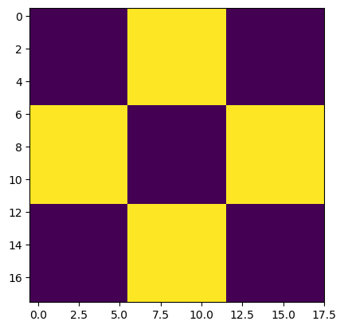
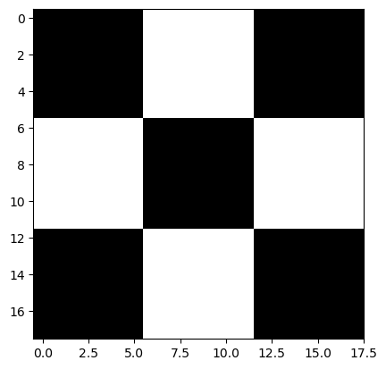
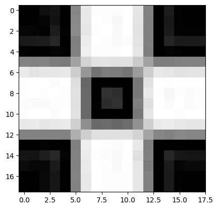
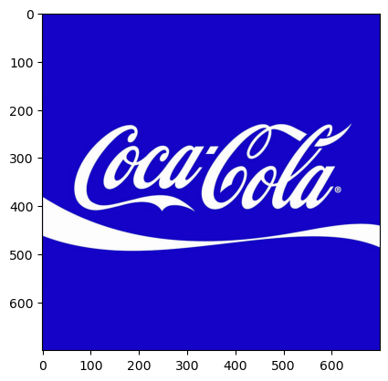
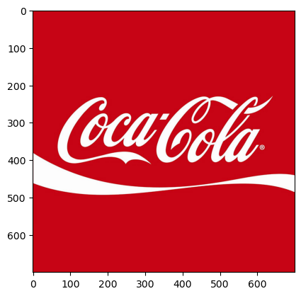
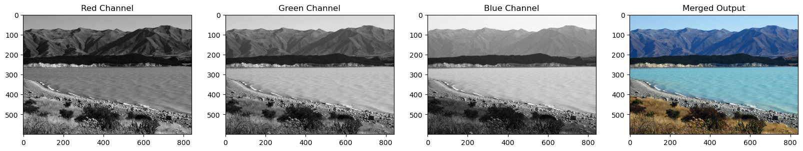
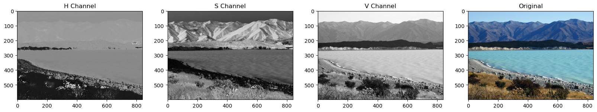
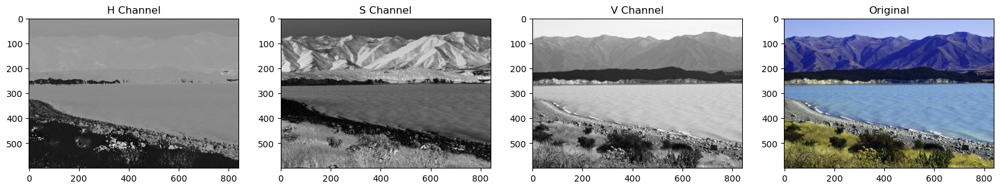
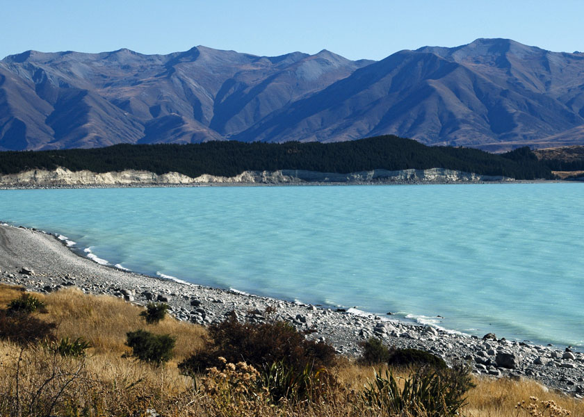

## Import Libraries


```python
import os
import cv2
import numpy as np
import matplotlib.pyplot as plt

from zipfile import ZipFile
from urllib.request import urlretrieve

from IPython.display import Image # To display images in Jupyter

# the following line is needed to display plots in Jupyter notebooks
%matplotlib inline
```

## Download Assets


```python
def download_and_unzip(url, save_path):
    print(f"Downloading and extracting assests....", end="")

    # Downloading zip file using urllib package.
    urlretrieve(url, save_path)

    try:
        # Extracting zip file using the zipfile package.
        with ZipFile(save_path) as z:
            # Extract ZIP file contents in the same directory.
            z.extractall(os.path.split(save_path)[0])

        print("Done")

    except Exception as e:
        print("\nInvalid file.", e)
```


```python
URL = r"https://www.dropbox.com/s/qhhlqcica1nvtaw/opencv_bootcamp_assets_NB1.zip?dl=1"

asset_zip_path = os.path.join(os.getcwd(), "opencv_bootcamp_assets_NB1.zip")

# Download if assest ZIP does not exists. 
if not os.path.exists(asset_zip_path):
    download_and_unzip(URL, asset_zip_path)   
```

##  Display Image Directly
We will use the following as our sample images. We will use the ipython image function to load and display the image.


```python
# Display 18x18 pixel image.
Image(filename="checkerboard_18x18.png")
```


    

    


```python
# Display 84x84 pixel image.
Image(filename="checkerboard_84x84.jpg")
```


    

    


# Reading images using OpenCV

OpenCV allows reading different types of images (JPG, PNG, etc). You can load grayscale images, color images or you can also load images with Alpha channel. It uses the **`cv2.imread()`** function which has the following syntax:

### <font color="green">Function Syntax </font>

``` python
retval = cv2.imread( filename[, flags] )
```

`retval`: Is the image if it is successfully loaded. Otherwise it is `None`. This may happen if the filename is wrong or the file is corrupt.

The function has **1 required input argument** and one optional flag:


1. `filename`: This can be an **absolute** or **relative** path. This is a **mandatory argument**.

2. `Flags`:    These flags are used to read an image in a particular format (for example, grayscale/color/with alpha channel). This is an **optional argument** with a default value of `cv2.IMREAD_COLOR` or `1` which loads the image as a color image.

Before we proceed with some examples, let's also have a look at some of the `flags` available.

**Flags**
1. **`cv2.IMREAD_GRAYSCALE`** or **`0`**: Loads image in grayscale mode
2. **`cv2.IMREAD_COLOR`** or **`1`**: Loads a color image. Any transparency of image will be neglected. It is the default flag.
3. **`cv2.IMREAD_UNCHANGED`** or **`-1`**: Loads image as such including alpha channel.


### <font color="green">OpenCV Documentation</font>

1. **`Imread`**:  <a href="https://docs.opencv.org/4.5.1/d4/da8/group__imgcodecs.html#ga288b8b3da0892bd651fce07b3bbd3a56" target="_blank">Documentation link</a>

2. **`ImreadModes`**: <a href="https://docs.opencv.org/4.5.1/d8/d6a/group__imgcodecs__flags.html#ga61d9b0126a3e57d9277ac48327799c80" target="_blank">Documentation link</a>


```python
# Read image as gray scale.
cb_img = cv2.imread("checkerboard_18x18.png", 0)

#The return from imread is a 2D numpy array.

# Print the image data (pixel values), element of a 2D numpy array.
# Each pixel value is 8-bits [0,255]
print(cb_img)
```

    [[  0   0   0   0   0   0 255 255 255 255 255 255   0   0   0   0   0   0]
     [  0   0   0   0   0   0 255 255 255 255 255 255   0   0   0   0   0   0]
     [  0   0   0   0   0   0 255 255 255 255 255 255   0   0   0   0   0   0]
     [  0   0   0   0   0   0 255 255 255 255 255 255   0   0   0   0   0   0]
     [  0   0   0   0   0   0 255 255 255 255 255 255   0   0   0   0   0   0]
     [  0   0   0   0   0   0 255 255 255 255 255 255   0   0   0   0   0   0]
     [255 255 255 255 255 255   0   0   0   0   0   0 255 255 255 255 255 255]
     [255 255 255 255 255 255   0   0   0   0   0   0 255 255 255 255 255 255]
     [255 255 255 255 255 255   0   0   0   0   0   0 255 255 255 255 255 255]
     [255 255 255 255 255 255   0   0   0   0   0   0 255 255 255 255 255 255]
     [255 255 255 255 255 255   0   0   0   0   0   0 255 255 255 255 255 255]
     [255 255 255 255 255 255   0   0   0   0   0   0 255 255 255 255 255 255]
     [  0   0   0   0   0   0 255 255 255 255 255 255   0   0   0   0   0   0]
     [  0   0   0   0   0   0 255 255 255 255 255 255   0   0   0   0   0   0]
     [  0   0   0   0   0   0 255 255 255 255 255 255   0   0   0   0   0   0]
     [  0   0   0   0   0   0 255 255 255 255 255 255   0   0   0   0   0   0]
     [  0   0   0   0   0   0 255 255 255 255 255 255   0   0   0   0   0   0]
     [  0   0   0   0   0   0 255 255 255 255 255 255   0   0   0   0   0   0]]
    


```python
# print the size  of image
print("Image size (H, W) is:", cb_img.shape)

# print data-type of image
print("Data type of image is:", cb_img.dtype)
```

    Image size (H, W) is: (18, 18)
    Data type of image is: uint8
    


# Display Images using Matplotlib


```python
# Display image.
plt.imshow(cb_img)
```


    <matplotlib.image.AxesImage at 0x23a972ff850>


    

    


### What happened?

Even though the image was read in as a gray scale image, it won't necessarily display in gray scale when using `imshow()`. matplotlib uses different color maps and it's possible that the gray scale color map is not set.


```python
# Set color map to gray scale for proper rendering.
plt.imshow(cb_img, cmap="gray")
```


    <matplotlib.image.AxesImage at 0x23a973d1cd0>


    

    


## Another example


```python
# Read image as gray scale.
cb_img_fuzzy = cv2.imread("checkerboard_fuzzy_18x18.jpg", 0)

# print image
print(cb_img_fuzzy)

# Display image.
plt.imshow(cb_img_fuzzy, cmap="gray")
```

    [[  0   0  15  20   1 134 233 253 253 253 255 229 130   1  29   2   0   0]
     [  0   1   5  18   0 137 232 255 254 247 255 228 129   0  24   2   0   0]
     [  7   5   2  28   2 139 230 254 255 249 255 226 128   0  27   3   2   2]
     [ 25  27  28  38   0 129 236 255 253 249 251 227 129   0  36  27  27  27]
     [  2   0   0   4   2 130 239 254 254 254 255 230 126   0   4   2   0   0]
     [132 129 131 124 121 163 211 226 227 225 226 203 164 125 125 129 131 131]
     [234 227 230 229 232 205 151 115 125 124 117 156 205 232 229 225 228 228]
     [254 255 255 251 255 222 102   1   0   0   0 120 225 255 254 255 255 255]
     [254 255 254 255 253 225 104   0  50  46   0 120 233 254 247 253 251 253]
     [252 250 250 253 254 223 105   2  45  50   0 127 223 255 251 255 251 253]
     [254 255 255 252 255 226 104   0   1   1   0 120 229 255 255 254 255 255]
     [233 235 231 233 234 207 142 106 108 102 108 146 207 235 237 232 231 231]
     [132 132 131 132 130 175 207 223 224 224 224 210 165 134 130 136 134 134]
     [  1   1   3   0   0 129 238 255 254 252 255 233 126   0   0   0   0   0]
     [ 20  19  30  40   5 130 236 253 252 249 255 224 129   0  39  23  21  21]
     [ 12   6   7  27   0 131 234 255 254 250 254 230 123   1  28   5  10  10]
     [  0   0   9  22   1 133 233 255 253 253 254 230 129   1  26   2   0   0]
     [  0   0   9  22   1 132 233 255 253 253 254 230 129   1  26   2   0   0]]
    


    <matplotlib.image.AxesImage at 0x23a97421090>


    

    


# Working with Color Images
Until now, we have been using gray scale images in our discussion. Let us now discuss color images.


```python
# Read and display Coca-Cola logo.
Image("coca-cola-logo.png")
```


    

    


## Read and display color image
Let us read a color image and check the parameters. Note the image dimension.


```python
# Read in image as a color image.
coke_img = cv2.imread("coca-cola-logo.png", 1)

# print the size  of image
print("Image size (H, W, C) is:", coke_img.shape)

# print data-type of image
print("Data type of image is:", coke_img.dtype)
```

    Image size (H, W, C) is: (700, 700, 3)
    Data type of image is: uint8
    

## Display the Image


```python
plt.imshow(coke_img)
#  What happened?
# The image is not displayed properly because OpenCV reads images in BGR format
# and matplotlib expects RGB format.
```


    <matplotlib.image.AxesImage at 0x23a974b9090>


    

    


The color displayed above is different from the actual image. This is because matplotlib expects the image in RGB format whereas OpenCV stores images in BGR format. Thus, for correct display, we need to reverse the channels of the image. We will discuss about the channels in the sections below.


```python
coke_img_channels_reversed = coke_img[:, :, ::-1]
plt.imshow(coke_img_channels_reversed)
```


    <matplotlib.image.AxesImage at 0x23a98527850>


    

    


# Splitting and Merging Color Channels


* **`cv2.split()`** Divides a multi-channel array into several single-channel arrays.

* **`cv2.merge()`** Merges several arrays to make a single multi-channel array. All the input matrices must have the same size.

### <font style="color:rgb(8,133,37)">OpenCV Documentation</font>

<a href="https://docs.opencv.org/4.5.1/d2/de8/group__core__array.html#ga0547c7fed86152d7e9d0096029c8518a" target="_blank">Documentation link</a>


```python
# Split the image into the B,G,R components
img_NZ_bgr = cv2.imread("New_Zealand_Lake.jpg", cv2.IMREAD_COLOR)
b, g, r = cv2.split(img_NZ_bgr)

# Show the channels
plt.figure(figsize=[20, 5])

plt.subplot(141);plt.imshow(r, cmap="gray");plt.title("Red Channel")
plt.subplot(142);plt.imshow(g, cmap="gray");plt.title("Green Channel")
plt.subplot(143);plt.imshow(b, cmap="gray");plt.title("Blue Channel")

# Merge the individual channels into a BGR image
imgMerged = cv2.merge((b, g, r))
# Show the merged output
plt.subplot(144)
plt.imshow(imgMerged[:, :, ::-1])
plt.title("Merged Output")
```


    Text(0.5, 1.0, 'Merged Output')


    

    


## Converting to different Color Spaces
 

**`cv2.cvtColor()`** Converts an image from one color space to another. The function converts an input image from one color space to another. In case of a transformation to-from RGB color space, the order of the channels should be specified explicitly (RGB or BGR). Note that the default color format in OpenCV is often referred to as RGB but it is actually BGR (the bytes are reversed). So the first byte in a standard (24-bit) color image will be an 8-bit Blue component, the second byte will be Green, and the third byte will be Red. The fourth, fifth, and sixth bytes would then be the second pixel (Blue, then Green, then Red), and so on.

### <font style="color:rgb(8,133,37)">Function Syntax </font>
``` python
dst = cv2.cvtColor( src, code )
```

`dst`: Is the output image of the same size and depth as `src`.

The function has **2 required arguments**:

1. `src` input image: 8-bit unsigned, 16-bit unsigned ( CV_16UC... ), or single-precision floating-point.

2. `code` color space conversion code (see ColorConversionCodes). 

### <font style="color:rgb(8,133,37)">OpenCV Documentation</font>

1. **`cv2.cvtColor`**: <a href="https://docs.opencv.org/3.4/d8/d01/group__imgproc__color__conversions.html#ga397ae87e1288a81d2363b61574eb8cab" target="_blank">Documentation link</a>  

2. **`ColorConversionCodes`**: <a href="https://docs.opencv.org/4.5.1/d8/d01/group__imgproc__color__conversions.html#ga4e0972be5de079fed4e3a10e24ef5ef0" target="_blank">Documentation link</a>

### Changing from BGR to RGB


```python
# OpenCV stores color channels in a differnet order than most other applications (BGR vs RGB).
# the following code converts BGR to RGB.
img_NZ_rgb = cv2.cvtColor(img_NZ_bgr, cv2.COLOR_BGR2RGB)
# now we don't need to reverse the channels and can use the standard matplotlib imshow
plt.imshow(img_NZ_rgb)
```


    <matplotlib.image.AxesImage at 0x23a994a25d0>


    

    


### Changing to HSV color space


```python
# this line converts the image to HSV and stores it in img_hsv
img_hsv = cv2.cvtColor(img_NZ_bgr, cv2.COLOR_BGR2HSV)

# Split the image into the h,s,v components
h,s,v = cv2.split(img_hsv)

# Show the h, s, v channels and the original image
plt.figure(figsize=[20,5])
plt.subplot(141);plt.imshow(h, cmap="gray");plt.title("H Channel");
plt.subplot(142);plt.imshow(s, cmap="gray");plt.title("S Channel");
plt.subplot(143);plt.imshow(v, cmap="gray");plt.title("V Channel");
plt.subplot(144);plt.imshow(img_NZ_rgb);   plt.title("Original");
```


    

    


## Modifying Individual Channel


```python
# h variable represents the hue channel and is a 2D numpy array.
#here we are adding 10 to each pixel value in the h channel.
h_new = h + 10
# Now we merge the new h channel with the original s and v channels using the cv2.merge function.
img_NZ_merged = cv2.merge((h_new, s, v))
# now we convert the image back to RGB and then store it as img_NZ_rgb
img_NZ_rgb = cv2.cvtColor(img_NZ_merged, cv2.COLOR_HSV2RGB)

# Show the channels
plt.figure(figsize=[20,5])
plt.subplot(141);plt.imshow(h, cmap="gray");plt.title("H Channel");
plt.subplot(142);plt.imshow(s, cmap="gray");plt.title("S Channel");
plt.subplot(143);plt.imshow(v, cmap="gray");plt.title("V Channel");
plt.subplot(144);plt.imshow(img_NZ_rgb);   plt.title("Original");
```


    

    


## Saving Images

Saving the image is as trivial as reading an image in OpenCV. We use the function **`cv2.imwrite()`** with two arguments. The first one is the filename, second argument is the image object.

The function imwrite saves the image to the specified file. The image format is chosen based on the filename extension (see cv::imread for the list of extensions). In general, only 8-bit single-channel or 3-channel (with 'BGR' channel order) images can be saved using this function (see the OpenCV documentation for further details).

	
### <font style="color:rgb(8,133,37)">Function Syntax </font>
``` python
cv2.imwrite( filename, img[, params] )
```

The function has **2 required arguments**:

1. `filename`: This can be an **absolute** or **relative** path. 

2. `img`: Image or Images to be saved.

### <font style="color:rgb(8,133,37)">OpenCV Documentation</font>

1. **`Imwrite`**: <a href="https://docs.opencv.org/4.5.1/d4/da8/group__imgcodecs.html#gabbc7ef1aa2edfaa87772f1202d67e0ce" target="_blank">Documentation link</a>

2. **`ImwriteFlags`**: <a href="https://docs.opencv.org/4.5.1/d8/d6a/group__imgcodecs__flags.html#ga292d81be8d76901bff7988d18d2b42ac" target="_blank">Documentation link</a>


```python
# save the image
cv2.imwrite("New_Zealand_Lake_SAVED.png", img_NZ_bgr)

Image(filename='New_Zealand_Lake_SAVED.png') 
```


    

    


```python
# read the image as Color
img_NZ_bgr = cv2.imread("New_Zealand_Lake_SAVED.png", cv2.IMREAD_COLOR)
print("img_NZ_bgr shape (H, W, C) is:", img_NZ_bgr.shape)

# read the image as Grayscaled
img_NZ_gry = cv2.imread("New_Zealand_Lake_SAVED.png", cv2.IMREAD_GRAYSCALE)
print("img_NZ_gry shape (H, W) is:", img_NZ_gry.shape)
```

    img_NZ_bgr shape (H, W, C) is: (600, 840, 3)
    img_NZ_gry shape (H, W) is: (600, 840)
    
